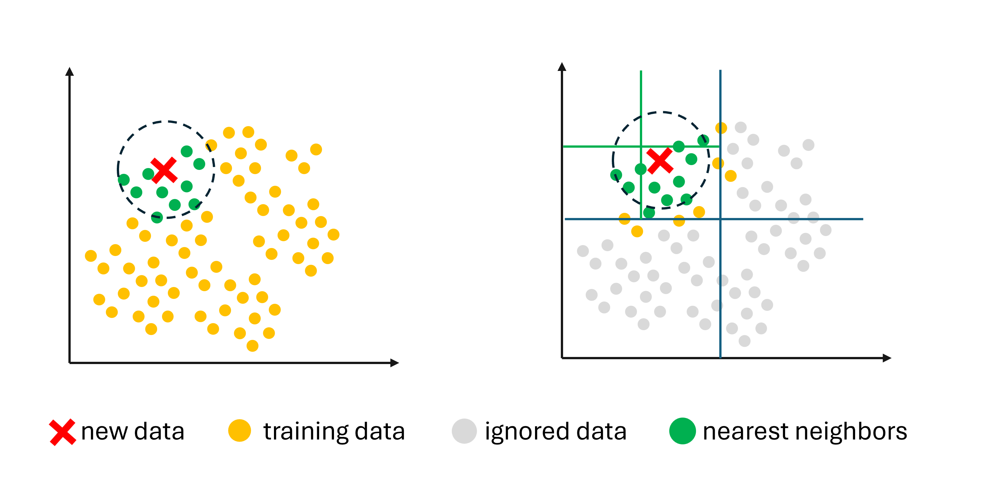

# The Octree

How are modern video games able to render vast worlds, with crystal clear graphics? How does YouTube know your watch preferences- often better than you do? And how do engineers model precise airflow over complex wing shapes on a jet? These 3 seemingly unrelated questions are answered with this one common data structure- the `Octree`.

An `Octree` is a data structure used for efficient `spatial querying`. It is created by recursively dividing a 3D space into small cubes, which sit nested within each other. This way, each level of the `Octree` subdivides the space into 8 cubes.

Usage of an `Octree` has been shown to improve Time Complexity from O(n) runtime to O(log n). Fundamentally, this means that increasing the data size by a factor of 100, will only increase the runtime by a factor of log(100) ~= 4.6.

`Octrees` are used widely in game development, `Nearest-Neighbor` algorithms, and Finite Element Analysis in CAD. Let's dive a little deeper into how they work.

## What is an Octree

An `Octree` is a special type of `k-D` Tree where the number of dimensions `k` = 3. It is constructed by repeatedly subdividing a 3D space into cubes. Each node of the `Octree` contains 8 children- which refers to the 8 sub-cubes that sit within a larger cube.

An important consideration here is that `octrees` do not store any data themselves- they are just used to quickly query data in a space. An Octree is used to answer the question- "Which objects in my scene are physically close to my area of interest"? In Video Games, the Octree may be used for player - object interactions.

Say our player has walked up to a treasure chest on the map and clicked the `A` button to open it. Now instead of searching through every treasure chest in the game to determine which one the player clicked on, we use an `Octree` to discard entire segments of the map and narrow our search down to only the specific segment which the player is closest to; vastly improving the performance.

Spatial querying can also be used in `Nearest Neighbor` algorithms, where the goal is to find the `N` closest data points in a group. Using an `Octree` (or `k-D` tree, more generally), will reduce the total number of objects that the algorithm needs to search through- significantly speeding up prediction time.

Let's work through an example that highlights this use case.

## Example: Finding the Closest Objects in a Search Radius

In 3D game engines, a common optimization technique is called Level of Detail (`LOD`) swapping. This process involves rendering objects that are far away from the player in low-resolution, and dynamically changing them to high-res when the player is near. This type of optimization has been shown to [improve the performance of the scene by roughly 3x](https://github.com/suryashch/LOD-control-with-threeJS/blob/main/reports/3d-model-LOD.md).

One downside to this technique is that our engine needs to calculate the distance between our player and every object in our scene. For large scenes, this may be impractical, and significantly hinder the performance.

We can use an `Octree` to speed things up. Since we know the player's current position in the world, we divide the 3D space into 8 cubes. Now, we measure the distance between our player and each one of these cubes. If the distance between a cube is too large, we can immediately discard all the objects in that entire cube. This method is called `pruning`, and as can be seen below, removes most of the objects in our scene.

If the cube meets our distance criteria, we divide it into a further 8 cubes and run our distance test again. This will eliminate another group of objects from our search set.

As we make our way down the levels of the `Octree`, the number of objects that meet our distance criteria continuously reduce, and eventually we're left with an extremely small subset of the original data points. Now when we call our `LOD` swapping function, we only need to calculate the distance between our player and this subset of objects- a significant computational saving.

I simulated some data to show the effects. [In this example](https://github.com/suryashch/3d_modelling/blob/main/research/optimizing-the-scene/notebooks/octree-querying.ipynb), we simulated a large 3D scene using a Numpy array. To this 3D space we added 2000 objects, as well as a `camera location`, that would serve as the coordinates of our player. We then generated the `Octree` search algorithm using recursion, as well as a function to draw the individual boxes. Here are the results.

| Algorithm | Total Objects | Objects Subsetted | Objects Within Radius |
|-----------|---------------|-------------------|-----------------------|
| Naive Search | 1,996 | 1,996 | 22 |
| Octree Search | 1,996 | 49 | 22|

In a scene with ~2000 objects, our octree-based algorithm narrows down the search to only 49 items. From these 49, we determined that 22 met our distance criteria. Comparing this with a naive search algorithm, we see that we get the same results, but at a fraction of the computational cost.

As our player moves around the scene, the `octree` is recalculated each frame and we can quickly identify which objects are near and far. This enables us to swap the resolution of the object (LOD) in near instantaneous time.

## Other Use Cases

There are strong parallels between `spatial querying` data structures and classification algorithms. The `K-Nearest Neighbor` algorithm makes predictions by comparing new data with examples in the training set that have similar features. This process involves measuring the similarities between our new data and every other data point in the training set.

Using a `k-D` tree (where `k` matches the number of dimensions) to perform the search significantly speeds things up.

## Conclusion

Trees are simple data structures that are omnipresent in computer science applications around the world. Out of these, the `Octree` is the most popular when working with data in 3 dimensions, due to its easy implementation and powerful results. We are surrounded by 3-dimensional datasets, most notably - Coordinates (X,Y,Z), Color channels (R,G,B), Financial Modelling (Risk, Reward, Sensitivity), Astrophysics (m1, m2, r), and many more.

With recent advents in Data Science and AI, the `Octree` looks like it will be sticking around for the long run.

### Links

[LOD Control in 3D Models](https://github.com/suryashch/LOD-control-with-threeJS/blob/main/reports/3d-model-LOD.md).

[Octree Querying With Python and Numpy](https://github.com/suryashch/3d_modelling/blob/main/research/optimizing-the-scene/notebooks/octree-querying.ipynb)

### Attributions

[1] Octree - WhiteTimberwolf, PNG version: Nü - Own work, CC BY-SA 3.0, https://commons.wikimedia.org/w/index.php?curid=9851485

[2] KNN Algorithm Example - Anthony Baum, Aug 4, 2023 8https://towardsdatascience.com/example-applications-of-k-nearest-neighbors-e6e47cd73f1f/

[3] Nvidia Gameplay footage https://media0.giphy.com/media/v1.Y2lkPTc5MGI3NjExamFmZHcwam40eWtvN2N4aDF5dXBndHc2cnBleGhrcjc0c21haTByNiZlcD12MV9pbnRlcm5hbF9naWZfYnlfaWQmY3Q9Zw/M93AaKxnpfiCUZsPnN/giphy.gif

